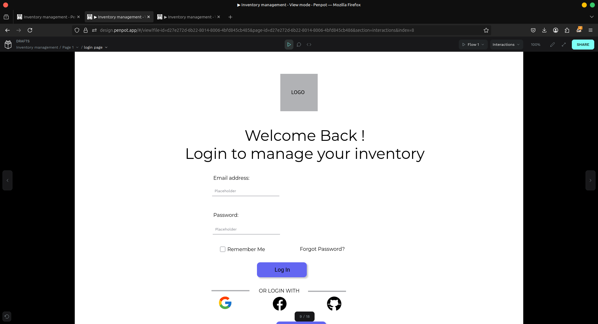
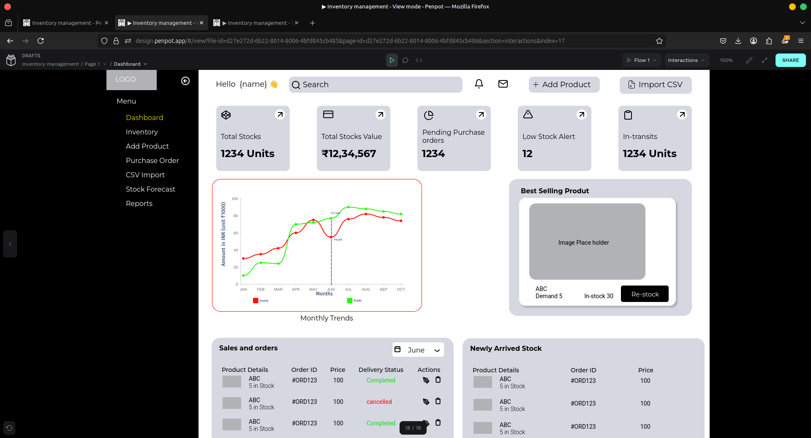
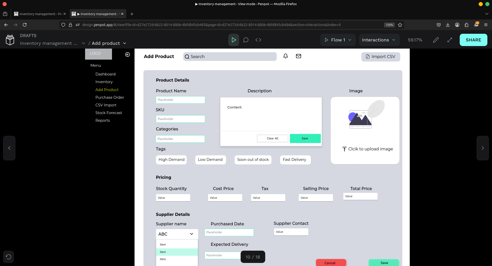

# 🧾 Inventory Management App

A sleek, modern inventory management solution designed to help businesses seamlessly manage stock, track orders, and coordinate with suppliers.

> 🚀 Hackathon Project  
> 📁 Current Status: UI/UX Design Prototype (Images in `/ui-design-screenshot` folder)

---

## 🖥️ UI Showcase
| Login | Dashboard | Product Management |
|-------|-----------|---------------------|
|  |  |  |

📌 [View all screenshots →][here](/ui-design-screenshot)

---

## 🎥 Demo Video

Watch a full walkthrough on YouTube:  
[📺 Click to Watch the Demo](https://youtu.be/wZopShMKPls)

---

## 📑 Project Overview

This app is being designed with usability and scalability in mind. It will eventually support robust inventory tracking, smart analytics, and streamlined supplier handling.

### 🔧 Key Features (Planned)

- Inventory Dashboard with KPIs  
- Order Management & Product Listings  
- Supplier Tracking & Notifications  
- Analytics (Revenue, Stock Trends, etc.)  

---

## 📂 Files Included

- `/ui-design-screenshots/` — UI Screens (PNG format)
- `Cyf1194_Web_Wizards_Phase1.pdf` — Hackathon presentation
- `README.md` — Project Overview

---

## 🛠️ Built With  

## 🛠️ Planned Tech Stack

  
  
  
  
  
  

---

## 🧠 Status

- ✅ UI/UX Design Completed
- ⏳ Frontend/Backend Under Development

---

## 🧑‍💻 Team & Contact
**Team**: [Web-WIzards (Tarun Rawat and Rishabh Awasthi)]  
**Contact**:   
  
**Hackathon**: [Cyfuture AI hackathon]

---

> ⚠️ This is an early-stage prototype for demonstration. Development in progress.
